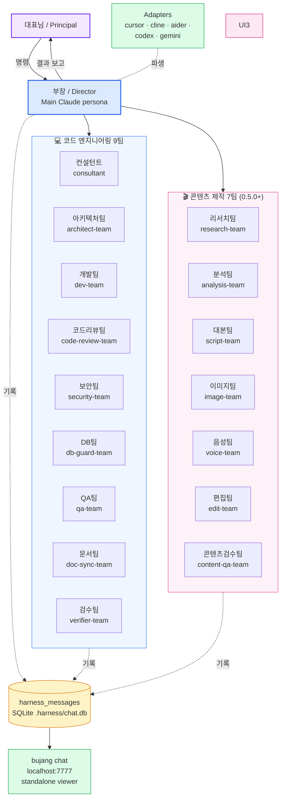

<div align="center">

# Harness-Bujang · 하네스 부장

**당신의 코드베이스에 부장님 한 분 모셔드립니다.**

[](LICENSE)
[](https://nodejs.org/)
[](https://github.com/bjcho4141/harness-bujang)

⚡ [한 줄 설치](#-한-줄-설치--one-line-install) · 🇰🇷 [한국어](#-한국어) · 🇺🇸 [English](#-english) · 🚀 [빠른 시작](#-빠른-시작) · 📦 [패키지](#-패키지)

</div>

---

## ⚡ 한 줄 설치 / One-line install

```bash
npx harness-bujang@latest init
```

→ 한국어 부장 페르소나 + **공동대표 페르소나** + 카톡 스타일 톡방 + **16팀 멀티 에이전트** (코드 9팀 + 콘텐츠 7팀) + **외부팀원 톡방** 이 현재 폴더에 설치됩니다. (인터랙티브 — 기본값 다 엔터로 OK)

### 💬 톡방 열기 — 두 가지 방법 (자연어 추천)

설치 끝나면 Claude Code 에서 **자연어 한 마디** 만 하시면 부장이 알아서 톡방 viewer 띄움:

```
"부장님 톡방 열어주세요"     ← 자연어 (추천)
"부장 톡방 오픈"
"톡방 보여줘"
```

→ 부장이 자동으로 `npx harness-bujang chat` 백그라운드 실행 → **브라우저 자동 오픈** → http://localhost:7777 카톡 UI 톡방.

닫고 싶을 때도 자연어:
```
"톡방 닫아줘"
```

수동으로 직접 띄우고 싶으면:
```bash
npx harness-bujang@latest chat
```

### 🎬 사용법 — Claude Code 안에서 자연어로

설치 끝나면 **Claude Code 에서 이름 부르고 일 시키기**. 두 가지 페르소나 + 16팀:

```
"부장님, 결제 환불 API 만들어주세요"
   ↓ 부장 (위계·실행 책임자)
   ├─ 사전 동의: "dev-team + security-team + db-guard 부르려는데 진행할까요?"
   ├─ 대표님 OK → 16팀 중 해당 팀 병렬 호출
   ├─ 톡방에 단계마다 INSERT (실시간 관전 가능)
   └─ 통합 보고

"공동대표, 우리 BM 이대로 가도 될까?"
   ↓ 공동대표 (피어·전략 파트너)
   ├─ 동등 토론 + 푸시백
   ├─ 필요 시 consultant / research-team 호출
   └─ 결정 푸시
```

**호출 규칙**:

| 호출 | 동작 |
|------|------|
| **"부장님 ..."** / "Director, ..." | Director 페르소나 → 사전 동의 + 매핑 + 톡방 INSERT + 통합 보고 |
| **"공동대표 ..."** / "Cofounder, ..." | Cofounder 페르소나 → 피어 토론·전략·푸시 |
| **그냥 "..."** (이름 안 부름) | Plain Claude — harness 룰은 알지만 풀 워크플로우는 안 돌림 |
| **"dev-team ..."** 직접 | ❌ 안 됨 — 16팀은 부장/공동대표가 디스패치해야 동작 |

> 💡 **풀 워크플로우 (사전 동의 + 매핑 + 톡방 + 통합 보고) 원하면 반드시 "부장님" / "공동대표" 호출.** 빨리 단순 작업이면 그냥 시키시면 됩니다 (Plain Claude).

자연어 트리거 (외울 필요 X — 자연스럽게):
- 톡방 열기: "부장님 톡방 열어주세요" / "톡방 오픈"
- 검토 의뢰: "부장님 PRD 검토 부탁드립니다"
- 새 팀 채용: "부장님 마케팅팀 한 명 채용해주세요"
- 전략 토론: "공동대표 의견 좀 주세요" / "공동대표가 보기엔 이거 어때?"

### 그 외 자주 쓰는 명령

```bash
# 설치 시 도구 어댑터 + 모델 매핑 한 번에 (0.6.0+)
npx harness-bujang@latest init --yes \
  --tools=cursor,codex,gemini \
  --models=balanced            # opus 6 + sonnet 7 + haiku 5, 토큰 ~60% 절감

# Cursor / Cline / Aider / Codex / Antigravity / Gemini 사후 추가
npx harness-bujang@latest adapt --to=all

# 새 버전 받기 — 기존 파일 안 건드리고 신규 팀만 추가 (안전)
npx harness-bujang@latest update

# 한국어 도움말 (디폴트, 0.6.2+) / 영어 도움말
npx harness-bujang@latest --help
npx harness-bujang@latest --help-en
```

> ## ⚠️ 처음 vs 업데이트 — 이거 꼭 알고 가세요
>
> | 상황 | 명령 | 무엇을 함 |
> |------|------|----------|
> | **처음 설치** (빈 프로젝트) | `npx harness-bujang init` | 부장 + 16팀 + 공동대표 전체 설치 |
> | **새 버전 받기** (이미 쓰던 사람) | `npx harness-bujang update` | **신규 파일만 추가**. 기존 에이전트 절대 안 건드림 |
> | **깨끗한 리셋** (커스텀 다 버리고 새로) | `npx harness-bujang init --yes` | **모든 에이전트 덮어쓰기** ⚠️ |
>
> **이미 쓰고 계셨다면 `update` 만 쓰세요.** `init --yes` 로 업그레이드하시면
> 그동안 부장님이 에이전트에 추가하신 도메인 룰·학습된 커스텀이 **다 날아갑니다**.
> `CLAUDE.md` / `docs/AGENT_LEARNING_LOG.md` 는 세 명령 모두 절대 안 건드립니다 (안전).

> Claude Code · Cursor · Cline · Aider · OpenAI Codex CLI · GitHub Copilot Coding Agent · Sourcegraph Cody · Google Antigravity · Gemini CLI · Gemini Code Assist 모두 호환.
>
> 자세한 옵션은 ↓ [빠른 시작](#-빠른-시작) 참조.

---

## 🇰🇷 한국어

### 무엇인가요?

**하네스 부장**은 Claude Code 위에서 동작하는 **다중 에이전트 오케스트레이션 하네스**입니다.
AI를 *도구*로 부리는 게 아니라, **동료·상사·팀원**으로 대하는 발상에서 출발했습니다.

설치하면 당신의 프로젝트에:

- 🧑‍💼 **부장** — 작업을 분해하고 팀에 분배하고 결과를 책임지는 메인 페르소나 (위계·실행 책임자)
- ⭐ **공동대표** *(0.5.1+)* — 대표님과 동등한 피어. 사업 아이디어·전략 토론·결정 푸시 (피어·전략 파트너)
- 💻 **코드 엔지니어링 9팀** — 개발 / 아키텍처 / 코드리뷰 / 보안 / DB / QA / 검수 / 문서 / 컨설턴트
- 🎬 **콘텐츠 제작 7팀** *(0.5.0+)* — 리서치 / 분석 / 대본 / 이미지 / 음성 / 편집 / 콘텐츠검수
- 🌐 **외부팀원 톡방** *(0.5.1+)* — 부장이 외부 도구 (vercel-plugin / Plan / general-purpose 등) 호출 시 자동 로깅
- 💬 **실시간 톡방** — 에이전트 간 모든 보고가 어드민 페이지·`bujang chat` viewer에서 라이브로 흐름
- 📚 **집단 학습 로그** — 실수·교훈이 영속 기록되어 세션 간 누적

…이 한 줄 명령으로 들어옵니다. **YouTube 영상 자동화부터 백엔드 API까지, 사업 계획부터 PRD까지** 한 부장 + 공동대표가 다 관리.

### 왜 만들었나요?

기존 단일-에이전트 워크플로우는 다음 한계가 있었습니다:

| 문제 | 단일 에이전트 | 하네스 부장 |
|---|---|---|
| 검수 단계 | 자기가 짠 코드 자기가 검수 → 실수 못 잡음 | 코드리뷰팀·보안팀·검수팀 별도 호출 |
| 진행 상황 가시성 | 결과만 텍스트로 옴 | 톡방에 단계별 실시간 기록 |
| 도메인별 전문성 | 모든 영역을 한 LLM이 처리 | 결제는 보안팀, DB는 DB팀 등 분담 |
| 학습 누적 | 매 세션 휘발 | `AGENT_LEARNING_LOG.md`에 영속 |
| 위계와 책임 | 평면적 | 부장 → 팀 → 검수 위계 |

영감의 출처는 Anthropic의 [Effective harnesses for long-running agents](https://www.anthropic.com/engineering/effective-harnesses-for-long-running-agents) 와 [Building agents with the Claude Agent SDK](https://www.anthropic.com/engineering/building-agents-with-the-claude-agent-sdk). 그 컨셉을 **한국식 위계 조직 메타포**로 풀어낸 구현체입니다.

### 작동 흐름

```
대표님 (당신)
    ↓ "결제 환불 API 만들어주세요"
부장 (Main Claude가 페르소나 인수)
    │
    ├─→ 작업 분해 + 팀 매핑표 조회
    │
    ├─→ Agent(consultant) — 크몽·토스페이먼츠 환불 패턴 벤치
    ├─→ Agent(architect-team) — API 라우트·DB 설계
    ├─→ Agent(dev-team) — 코드 작성 (병렬 가능)
    ├─→ Agent(security-team) — 결제 도메인이라 필수
    ├─→ Agent(code-review-team) — 컨벤션·타입 검증
    ├─→ Agent(db-guard-team) — 마이그레이션·FK 검증
    ├─→ Agent(qa-team) — 시나리오 테스트
    └─→ Agent(verifier-team) — 빌드·회귀·최종 PASS
        ↓
    각 단계마다 harness_messages 톡방에 INSERT
        ↓
    bujang chat (localhost) 에서 실시간 관전
        ↓
대표님께 통합 보고
```

### 핵심 가치

- 🎯 **개입 지점 명확** — "이건 부장님 결정 부탁드립니다" 식으로 인간 게이트가 명시됨
- 🔍 **검수 다층화** — 5단계 검증 (빌드·기능·코드·도메인·회귀)이 강제 체크리스트
- 📊 **로그 영속화** — 누가 언제 무엇을 했는지 톡방 + DB에 남음
- 🌐 **다국어** — 한국어(부장 페르소나) / 영어(Director) 양쪽 지원
- 🛠 **다중 스택** — Next.js / SvelteKit / Astro / Nuxt / Rails / Django / Python / Rust 자동 감지

---

## 🇺🇸 English

**Harness-Bujang** (*"bujang"* — Korean for *department director*) is a multi-agent orchestration harness for Claude Code. It models AI not as a tool but as **colleagues reporting up a chain of command**: a Director plus 7 specialist teams, a Consultant for benchmarking, a Verifier as the final gate, plus a real-time chat room you can watch in an admin UI.

Inspired by Anthropic's [harness engineering writings](https://www.anthropic.com/engineering/effective-harnesses-for-long-running-agents). One-line install via Claude Code plugin or `npx harness-bujang init`.

```
You (the principal)
   ↓ "Add a refund API"
Director (Main Claude persona)
   ├─→ consultant      — benchmarking
   ├─→ architect-team  — design
   ├─→ dev-team        — implementation (parallel)
   ├─→ security-team   — payment domain → required
   ├─→ code-review · db-guard · qa
   └─→ verifier-team   — final gate
       ↓
   Every step → harness_messages chat → live admin UI
```

18 personas (1 director + 1 cofounder + 9 engineering + 7 content), 5 slash commands, full Korean / English variants. See [packages/cli/README.md](./packages/cli/README.md) for usage.

**One-line install + multi-tool fan-out** (0.6.0+):

```bash
npx harness-bujang init --yes \
  --tools=cursor,codex,gemini \    # one-shot adapter fan-out
  --models=balanced                # opus / sonnet / haiku mix, ~60% cost cut
```

**Hybrid agent prompts** (0.7.0+): instructions in English, persona names (부장 / 대표님) and chat-room utterances in Korean — ~30–40% token savings while keeping the Korean-style harness identity. Use `--lang=en` for full English variant.

**Persistent read state** (0.6.1+): chat-room "unread" markers live in `harness_read_state` SQLite table — survives port changes, server restarts, and even syncs across machines when chat.db is shared.

### 아키텍처 한눈에



- 보라 = 사용자 / 파랑 = 부장 / 코드 9팀 (파란 박스) / 콘텐츠 7팀 (분홍 박스) / 노랑 = 데이터 / 초록 = viewer / 분홍 = 다른 도구 어댑터.
- 점선 (`-.기록.->`) = `harness_messages` 테이블 INSERT.
- 부장은 작업 도메인에 따라 코드 9팀 또는 콘텐츠 7팀 (또는 둘 다) 호출.
- `bujang chat` 어떤 스택에서든 동일한 카톡 UI.
- `bujang adapt` 로 Cursor / Cline / Aider / Codex / Gemini 등 다른 도구에 동일 페르소나 배포.

---

## 🚀 빠른 시작

세 가지 길이 있습니다. 환경에 맞춰 선택하세요.

### 길 A — Claude Code 사용자 (가장 짧음)

```
/plugin install bjcho4141/harness-bujang
/bujang-init
```

→ 영어 에이전트 + 슬래시 커맨드 5종이 한 줄로 설치됩니다. `/bujang-init`이 프로젝트 자동 스캔 후 `.claude/agents/`에 채워줍니다. 설치 후 Claude Code 완전 종료 → 다시 시작 → `/open-chat` 한 번이면 톡방 자동 오픈.

### 길 B — CLI (어떤 환경이든)

```bash
# 인터랙티브 설치 — 언어 / 백엔드 / 도구 어댑터 / 모델 매핑 등을 화면에서 (기본: 한국어 부장)
npx harness-bujang init

# 외운 사람용 — 질문 다 스킵, 한국어 부장 즉시 설치
npx harness-bujang init --yes

# 멀티 도구 사용자 — Claude Code + Codex + Gemini 한 번에 (0.6.0+)
npx harness-bujang init --yes --tools=codex,gemini

# 모델 프리셋 (0.6.0+) — balanced (추천, ~60% 비용 절감) / cost (전부 haiku) / quality (전부 opus)
npx harness-bujang init --yes --models=balanced

# 영어 페르소나로 가고 싶을 때
npx harness-bujang init --lang=en

# 다른 폴더
npx harness-bujang init --target=./my-app
```

→ Cursor / Cline / Aider / Codex / Gemini 모두 `--tools=` 한 번으로 어댑터 자동 깔림 (0.6.0+).
→ Claude Code agents 의 instructions 는 영어, 부장 발화는 한국어 hybrid 톤 (0.7.0+) — LLM 토큰 ~30~40% 절감 + 부장 페르소나 정체성 유지.

#### 톡방 보기 — 어떤 스택이든 한 줄

```bash
npx harness-bujang chat --create
# → 브라우저 자동 오픈 → http://localhost:7777 (KakaoTalk-style 톡방)
```

Next.js 의존도 없고, 별도 셋업도 없습니다. SQLite 파일 (`<project>/.harness/chat.db`)을 직접 읽어서 카톡 UI로 띄움. Rails / Django / Express / Rust 어디서든 동작.

### 길 C — 수동 (커스터마이즈 원할 때)

```bash
git clone https://github.com/bjcho4141/harness-bujang.git
cp -r harness-bujang/shared/agents/ko/* ./your-project/.claude/agents/
# CLAUDE.md 에 shared/templates/ko/CLAUDE.md.harness-section.template 내용 추가
```

→ 100% 자기 입맛으로 수정 가능. placeholder는 직접 채우거나 그대로 두면 됩니다.

---

## 📦 패키지

| 패키지 | 역할 | npm | 설치 |
|---|---|---|---|
| [`packages/plugin`](./packages/plugin) | Claude Code Plugin (18 agents + 5 slash commands) | — | `/plugin install bjcho4141/harness-bujang` |
| [`packages/cli`](./packages/cli) | `harness-bujang init` 인스톨러 | `harness-bujang` | `npx harness-bujang init` |

공유 자산(SSoT):
- [`shared/agents/ko/`](./shared/agents/ko) · [`shared/agents/en/`](./shared/agents/en) — 에이전트 정의 **18개** × 2 언어 (director + cofounder + 코드 9팀 + 콘텐츠 7팀)
- [`shared/templates/ko/`](./shared/templates/ko) · [`shared/templates/en/`](./shared/templates/en) — `CLAUDE.md` 섹션 + 학습로그 시드

> 0.7.0+ ko 버전은 **하이브리드 톤** — instructions / 룰 / 매핑 표는 영어 (LLM 효율), 페르소나 호칭 (부장 / 대표님 / 공동대표) 과 톡방 발화 ("완료했습니다", "판단 부탁드립니다") 는 한국어 유지.

---

## 🛠 호환성 매트릭스

### 프레임워크 자동 감지

| 스택 | 감지 | `bujang chat` standalone |
|---|---|---|
| Next.js (App Router) | ✅ | ✅ |
| SvelteKit | ✅ | ✅ |
| Astro / Nuxt | ✅ | ✅ |
| Rails | ✅ | ✅ |
| Django / FastAPI | ✅ | ✅ |
| Python (general) | ✅ | ✅ |
| Rust / Go | ✅ | ✅ |
| Generic Node.js | ✅ | ✅ |

`bujang chat` 은 모든 스택에서 동일하게 동작 — SQLite 파일을 직접 읽어 localhost 카톡 UI 로 띄움. 사용자 프로젝트는 1도 안 건드림 (0.9.0 이후 admin 라우트 자동 설치 제거).

### DB 자동 감지

| DB | 감지 | RLS 마이그레이션 호환 |
|---|---|---|
| Supabase (Postgres + Auth) | ✅ | ✅ |
| Prisma + Postgres | ✅ | ⚠️ predicate 수정 필요 |
| Drizzle ORM | ✅ | ⚠️ |
| TypeORM / Sequelize | ✅ | ⚠️ |
| (없음) | ✅ | ❌ 톡방 UI 미설치 |

### Claude Code 도구 호환 (0.4.0+ 어댑터로 9+ 도구 호환)

| 도구 | agents 인식 | 어댑터 명령 | 비고 |
|---|---|---|---|
| Claude Code (공식) | ✅ | (자동) | 풀 호환 — `.claude/agents/*.md` 직접 |
| Cursor | ✅ | `--to=cursor` | `.cursor/rules/bujang-*.mdc` 자동 생성 |
| Cline | ✅ | `--to=cline` | `.clinerules/bujang-*.md` 자동 생성 |
| Aider | ✅ | `--to=aider` | `CONVENTIONS.md` + `.aider.conf.yml` |
| OpenAI Codex CLI / Copilot Coding Agent / Sourcegraph Cody | ✅ | `--to=codex` | `AGENTS.md` 표준 |
| Google Antigravity / Gemini CLI / Code Assist | ✅ | `--to=gemini` | `GEMINI.md` + `.gemini/styleguide.md` (PR 리뷰) |
| 모두 한 번에 | ✅ | `--to=all` | 위 5개 어댑터 동시 |

> 0.6.0+ 부터 `init --tools=cursor,codex,gemini` 한 줄로 init + 모든 어댑터 동시 설치.

### Node.js / OS

- **Node.js**: 20+ 필수 (engines.node 명시)
- **OS**: macOS · Linux · Windows (path 처리 표준)
- **패키지 매니저**: npm · pnpm · yarn · bun 호환

---

## 🎨 커스터마이즈

### 부장 호칭 바꾸기

`/bujang-init` 후 생성된 `.claude/agents/director.md`에서:

```markdown
당신은 **부장**입니다.   ← 이걸 "팀장" / "리드" / "CTO" 등으로 변경
```

`harness-client.tsx`의 `ROLES` 객체도 같이 수정하면 톡방 UI 라벨도 따라갑니다.

### 팀 추가/삭제

```bash
# devops-team 추가
cp .claude/agents/security-team.md .claude/agents/devops-team.md
# 내용을 devops 책임 영역으로 수정
# director.md 의 "작업 유형별 담당팀 매핑" 표에 행 추가
```

### 도메인별 감사팀 자동 발동 룰 변경

`director.md`의 다음 섹션을 수정:

```markdown
### 감사팀 필수 발동 조건
- **결제·정산** → security-team 필수
- **DB 스키마·마이그·RLS** → db-guard-team 필수
- **인증·권한·개인정보** → security-team 필수
- **약관·법적 문구** → 3단 감사
```

### 톡방 UI 톤·테마

`harness-client.tsx` 의 `ROLES` 색상·이모지 + Tailwind 클래스 수정. KakaoTalk 노란 말풍선이 디폴트, 원하는 색으로.

---

## 📊 작동 검증된 시나리오

이 시스템은 **VibeFlea** ([vibeflea.com](https://vibeflea.com)) — 한국 바이브코딩 외주 플랫폼 — 에서 6주간 실전 운용된 후 추출되었습니다. 처리한 작업 예시:

- 카카오/네이버/구글 OAuth 통합 (security-team + dev-team 협업)
- 결제 (KG이니시스 PC + 에스크로) — security-team 5회 차단·수정 사이클
- 등급 시스템 6개 지표 자동 평가 (architect-team 설계)
- 가입 환영 알림톡 의뢰자/코더 분리 (consultant 자문 → dev-team 구현)
- 에이전트 격노 사건 학습 — `줄글 보고`·`톡방 INSERT 누락` 영구 룰화

학습 로그 시드는 [`shared/templates/ko/AGENT_LEARNING_LOG.seed.md`](./shared/templates/ko/AGENT_LEARNING_LOG.seed.md) 참조.

---

## 🗺️ 로드맵

- [x] 에이전트 10종 정의 (한국어 / 영어)
- [x] Claude Code Plugin (`/plugin install`)
- [x] CLI (`npx harness-bujang init/status`)
- [x] Next.js + Supabase 톡방 UI 템플릿
- [x] 8개 프레임워크 + 5개 ORM 자동 감지
- [x] npm 정식 publish — [`harness-bujang@0.7.0`](https://www.npmjs.com/package/harness-bujang) 라이브 (2026-05-10)
- [x] 인터랙티브 `init` — `@inquirer/prompts` 기반 언어/백엔드/UI 선택 + 기존 설치 감지 시 overwrite 프롬프트 (0.2.0/0.2.1)
- [x] 슬래시 커맨드 directive 화 — `/bujang-init`, `/bujang-status`, `/bujang-team`, `/bujang-report` 모두 실제 액션 형태로 재작성 (0.2.0)
- [x] **비-Next.js standalone viewer (`bujang chat`)** — Node http + 임베디드 HTML + system sqlite3 (0.3.0)
- [x] **sandbox e2e 검증 스크립트** — `npm run sandbox-test` (0.3.0/0.4.0)
- [x] **Cursor / Cline / Aider / Codex / Gemini 어댑터** — `bujang adapt --to=<...>` 5개 어댑터 → 9+ 도구 호환 (0.4.0)
- [x] **README Mermaid 아키텍처 다이어그램** (0.4.0)
- [x] 톡방 입력창 제거 (Director 자동 픽업 없으면 dead UI) (0.4.1)
- [x] 한국어 디폴트 + 프롬프트 첫 선택지 한국어로 (0.4.2)
- [x] director.md 에 "새 팀원 채용 절차" 6단계 명시 (0.4.3)
- [x] 톡방 viewer "전체 / 안읽음" 카톡 스타일 필터 (0.4.4)
- [x] **콘텐츠 제작 7팀 추가** — research / analysis / script / image / voice / edit / content-qa. 코드 9팀 + 콘텐츠 7팀 = 총 16팀 (0.5.0)
- [x] **공동대표 페르소나** — 대표님과 동등한 피어 (사업 아이디어·전략 토론·결정 푸시) (0.5.1)
- [x] **외부팀원 톡방** — 부장 외부 호출 (vercel-plugin / Plan / general-purpose) 자동 로깅 (0.5.1)
- [x] **사전 동의 프로토콜** — 디스패치 전 대표님 승인 + 외부 도구 임계값 (1회 / 2~3회 / 5+ 회) (0.5.1)
- [x] **PRD / 사업 계획 매핑** 테이블 4행 추가 (0.5.1)
- [x] **`bujang update` 명령** — 기존 에이전트 파일 절대 안 건드림. 신규 파일만 추가 — 사용자 커스텀 100% 보존 (0.5.2)
- [x] 톡방 사이드바 스크롤 튕김 / 부장→대표님 라우팅 / chat 첫 실행 자동 DB 생성 (0.5.3 ~ 0.5.6)
- [x] **`bujang chat` better-sqlite3 마이그레이션** — system sqlite3 CLI shell-out → 임베디드 네이티브 prebuild (0.5.7)
- [x] 윈도우 전용 픽스 — `openBrowser()` ENOENT (0.5.8) · `init` silent death (0.5.9, 모든 커맨드 dynamic import) — 윈도우 zero-install 정상화
- [x] **🔒 1:1 매핑 룰** — Agent 툴 호출 1번 = `harness_messages` INSERT 1행. 병렬 N팀 호출 시 INSERT N건. 사전 동의 → INSERT → Agent 호출 → 결과 INSERT 순서 고정. director / cofounder 페르소나 + CLAUDE.md 템플릿 (한·영 6개 파일) inline 박음 (0.5.10)
- [x] **🔁 멀티 도구 init + 에이전트별 모델 매핑** — `init` 인터랙티브 / `--tools=cursor,codex,gemini,all` flag 로 어댑터 자동 fan-out (Claude Code 는 항상 SoT). `--models=balanced|keep|cost|quality` 모델 프리셋 — balanced 매핑 (opus 6 + sonnet 7 + haiku 5) ~60% 비용 절감 (0.6.0)
- [x] **📬 톡방 read-state SQLite 화** — `harness_read_state` 테이블 + `GET / POST /api/read-state`. chat.db SoT 라 포트 변경 / 서버 재시작 / 다른 브라우저 무관 read 상태 영구 보존. 다중 PC 자동 동기화 (0.6.1)
- [x] **🇰🇷 `--help` 한국어 디폴트** — `--help` / `-h` 한국어 출력. 영어는 `--help-en` (0.6.2)
- [x] **🌏 에이전트 .md 하이브리드 변환** — `shared/agents/ko/*.md` 18개 + CLAUDE.md template instructions / 룰 / 매핑 표 영어로. 페르소나 호칭 (부장 / 대표님 / 공동대표) + 톡방 발화 ("완료했습니다") 한국어 유지. 토큰 ~30~40% 절감 + LLM 인지력 향상 (0.7.0)
- [ ] `harness-bujang@1.0.0` 안정 버전 (실사용 피드백 후)
- [ ] Claude Code 마켓플레이스 등록
- [ ] 데모 GIF / Cast 영상
- [ ] better-sqlite3 + Next.js 라우트 통합 e2e 검증

---

## 🤔 자주 묻는 질문

<details>
<summary><b>Q. 왜 한국어 페르소나(부장)를 영어 패키지에 박았나요?</b></summary>

A. 영어권에 이미 비슷한 다중 에이전트 프레임워크 (CrewAI / AutoGen / LangGraph)가 많습니다. 차별화 포인트는 **한국식 위계 조직 메타포**입니다. 영어권 사용자가 "Bujang? What does that mean?" 하고 클릭하는 순간 우리만의 정체성이 박힙니다. 다만 옵션 `--lang=en`으로 영어 톤으로 갈아탈 수 있습니다.

</details>

<details>
<summary><b>Q. Anthropic의 Claude Agent SDK와는 어떻게 다른가요?</b></summary>

A. Claude Agent SDK는 **빌딩 블록**(SDK 레벨)이고, 하네스 부장은 그 위에서 작동하는 **오피니어네이티드 패턴**입니다. SDK가 "어떻게 에이전트를 만들 건지"라면, 하네스 부장은 "10명짜리 한국식 IT 부서를 어떻게 운영할 건지"의 답입니다.

</details>

<details>
<summary><b>Q. 톡방 viewer 안 띄워도 쓸 수 있나요?</b></summary>

A. 네. 에이전트 정의 + INSERT 만으로도 동작합니다. 톡방 viewer (`bujang chat`) 는 가시성 보너스 — `.harness/chat.db` SQLite 에 모든 기록이 쌓이고, viewer 는 필요할 때만 띄우면 됩니다. 핵심 가치는 위계 + 5단계 검증입니다.

</details>

<details>
<summary><b>Q. 만든 사람은 누구이고 왜 만들었나요?</b></summary>

A. [VibeFlea](https://vibeflea.com) 1인 개발 중 단일 에이전트로는 결제·인증·법적 문구 같은 **민감 도메인 검수가 약하다**는 한계를 마주쳤습니다. "내 코드에 부장이 한 명 있으면 좋겠다"에서 시작해서, 6주 운용 후 범용화한 결과물입니다.

</details>

---

## 📜 라이선스

MIT © 2026 [bjcho4141](https://github.com/bjcho4141) (Field Coding · 필드코딩)

자유롭게 fork·수정·재배포 환영. 하네스 부장이 당신의 프로젝트에서도 잘 일하길 바랍니다. 🙏
