# AgentOS Issue Sequencing Graph

> Snapshot documentation imported from #1291. This page is informational only; #961 remains the canonical AgentOS roadmap SSOT, and #1256 remains the product-policy SSOT for the `ooo auto` closure ladder.

Snapshot: 2026-05-29 18:40 KST.

This document is a point-in-time triage view for the AgentOS issue set. It is
not a new source of truth. GitHub issues, especially #961 and #1256, remain the
normative records. Use this page to see which recently merged PRs resolved
which roadmap tracks, which open issues are still intentionally open, and what
order the remaining work should follow.

## Source Of Truth

- #961 is the AgentOS roadmap sequencing SSOT.
- Track B's implementation merge train is reconciled. #1256 owns the remaining
  product-policy decisions, but they are not open autonomous implementation
  work.
- #939 remains the plugin lifecycle umbrella after its docs/schema slices.
- The GitHub open issue list is the closure authority. At this snapshot there
  are 20 open issues, and none has enough merged evidence to close safely.

## Sequencing Graph

```mermaid
flowchart TD
    LegendMeta["Meta / RFC SSOT"]
    LegendOpen["Open: design or implementation remains"]
    LegendMerged["Merged PR / delivered slice"]
    LegendClosed["Closed issue"]
    LegendBacklog["Backlog / later design"]

    I961["#961 AgentOS roadmap SSOT"]

    I961 --> A["Track A: fat harness COMPLETE"]
    A --> A920["#920 closed"]
    A --> A925["#925 closed"]
    A --> A960["#960 closed"]
    A --> A1282["#1282 merged: health readiness snapshot"]

    I961 --> B["Track B: ooo auto IMPLEMENTATION RECONCILED"]
    B --> I1157["#1157 auto vision SSOT"]
    I1157 --> I1256["#1256 Product-or-Die RFC"]
    I1256 --> B1257["#1257 closed by #1269-#1272"]
    I1256 --> B1260["#1260 merged: first EventStore slice"]
    I1256 --> I1254["#1254 open: all auto state transitions"]
    I1256 --> I1258["#1258 open: perf regression approval/design"]
    I1256 --> I1170["#1170 open: canonical product matrix"]
    I1256 --> I1263["#1263 open: aggressive autofill design"]
    I1256 --> I1234["#1234 open: verifier pipeline policy"]
    B --> B1281["#1281 merged: checkpoint isolation"]
    B --> B1284["#1284 merged: interview progress relay"]
    B --> B1286["#1286 merged: detached job UX"]
    B --> B1289["#1289 merged: #1283 residue"]
    B --> B1290["#1290 merged: #1285 residue"]

    I961 --> C["Track C: AgentOS substrate / plugins"]
    C --> C946["#946 closed"]
    C --> C956["#956 closed"]
    C --> C1276["#1276 merged: artifact/state hook contract"]
    C --> C1277["#1277 merged: plugin v0.4 schema"]
    C --> I939["#939 open: remaining lifecycle hooks/audit work"]

    I961 --> D["Design backlog"]
    D --> I518["#518 AgentProcess lifecycle"]
    D --> I614["#614 external guidance contract"]
    D --> I615["#615 reasoning budget policy"]
    D --> I813["#813 Symposium primitive"]
    I813 --> I814["#814 verdict envelope"]
    I813 --> I815["#815 stateful debate policy"]
    I813 --> I816["#816 evaluate consensus migration"]
    I813 --> I819["#819 persistent transcript"]
    D --> I831["#831 interview MCP hang watchlist"]
    D --> I1139["#1139 Pi runtime bridge"]
    D --> I1239["#1239 reference-aware interviews"]

    classDef meta fill:#fef3c7,stroke:#d97706,color:#111827,stroke-width:2px
    classDef open fill:#fee2e2,stroke:#dc2626,color:#111827,stroke-width:2px
    classDef merged fill:#dcfce7,stroke:#16a34a,color:#111827,stroke-width:2px
    classDef closed fill:#e0f2fe,stroke:#0284c7,color:#111827,stroke-width:2px
    classDef backlog fill:#f3e8ff,stroke:#7e22ce,color:#111827,stroke-width:2px
    classDef track fill:#f8fafc,stroke:#64748b,color:#111827,stroke-width:1px

    class LegendMeta,I961,I1157,I1256 meta
    class LegendOpen,I1254,I1258,I1170,I1263,I1234,I939 open
    class LegendMerged,A1282,B1260,B1281,B1284,B1286,B1289,B1290,C1276,C1277 merged
    class LegendClosed,A920,A925,A960,B1257,C946,C956 closed
    class LegendBacklog,I518,I614,I615,I813,I814,I815,I816,I819,I831,I1139,I1239 backlog
    class A,B,C,D track
```



## Closure Verdict

No currently open issue is safe to close from the available evidence.

The merged PRs have resolved important slices, but the open issues are still in
one of these states:

- Meta or RFC SSOT that must stay open while downstream tracks converge.
- Partially implemented umbrella with remaining scoped work.
- Needs-design or needs-approval item that requires a human decision before
  implementation can be declared complete.
- Backlog design issue unrelated to the recent auto/detached-job merge train.

Already closed items with clear closure evidence include #920, #925, #946,
#956, #960, #1257, #1267, #573, #575, and #476.

## `ooo auto` Release Position

Track B is release-ready as an implementation track, but #1256 should stay open
as a policy/RFC umbrella.

What this release can safely claim:

- `ooo auto --complete-product` has a real Interview -> Seed -> Run -> Ralph
  product chain, with foreground completion when Ralph reaches a terminal
  success and tracked detached background work when ownership moves out of the
  client wait budget.
- Detached auto is not treated as failure: CLI/MCP status, wait, and result
  surfaces expose stable handles and polling guidance.
- The R3 failure class from #1256/#1257 is fixed: an interview phase deadline no
  longer terminally reports `interview_phase_deadline` BLOCKED. It routes
  through `partial_seed_from_evidence`, emits `runtime.deadline.interview.fired`
  before `auto.product.partial_emitted`, and surfaces
  `partial_product=True` with unresolved slots as next-step hints.
- Degraded partial Seeds relax ambiguity/open-gap blockers only for recoverable
  missing evidence. Safety blockers and explicit human-required ledger BLOCKED
  entries still block.
- Canonical `cli-todo` product-complete shape exists and validates fixture
  shape in CI; the live canonical run remains manual opt-in because it consumes
  real LLM/runtime budget.

What this release should not over-claim:

- #1256 Product-or-Die is not fully adopted as a global invariant. The codebase
  still has legitimate BLOCKED states for safety, missing structural goal,
  failed run handoff, Ralph terminal failure, and other recoverable operator
  states.
- #1263 aggressive LLM auto-fill is not implemented as a general policy. Safe
  defaults and degraded partial Seeds exist, but "auto-fill every gap with LLM
  inference" remains owner-approved future policy.
- #1254 unified EventStore coverage is only partially implemented. The
  interview/deadline/partial-product path has typed evidence, but the RFC's
  "every transition in every phase" contract is still umbrella work.
- #1258 throughput/per-round regression remains approval-gated. Guardrails and
  R-run lint exist, but the release should not claim improved auto throughput.
- #1170 I6 product reality is represented by the canonical harness and
  `cli-todo` shape/live-run path, not by a full 3-task product matrix.

Focused verification on this snapshot:

```text
uv run pytest tests/unit/auto/test_pipeline_partial_product_terminal.py \
  tests/integration/auto/test_interview_deadline_partial_product_regression.py \
  tests/canonical/test_canonical.py \
  tests/unit/mcp/tools/test_start_auto.py \
  tests/unit/cli/test_job_command.py -q

82 passed, 1 skipped
```

## Recently Merged Evidence

| PR | Merged | Track | Delivered behavior | Disposition |
| --- | --- | --- | --- | --- |
| #1290 | 2026-05-29 09:30 UTC | Track B | Carried the linked-stream residue from closed-unmerged #1285 into the branch that actually merged. This preserves the intended stream/attachment behavior without depending on the abandoned PR. | Detached stream residue is merged; no open issue closes from this alone. |
| #1289 | 2026-05-29 09:31 UTC | Track B | Carried the auto-dispatch residue from closed-unmerged #1283 into the branch that actually merged. This keeps CLI/MCP detached auto dispatch aligned after the superseding UX PR. | Dispatch residue is merged; #1283 itself stays closed-unmerged. |
| #1286 | 2026-05-29 06:12 UTC | Track B | Improved detached auto job tracking UX so auto runs are treated as tracked background work rather than terminal failures when the client stops waiting. | Main detached async UX slice is merged; follow-up residue landed in #1289/#1290. |
| #1284 | 2026-05-29 06:12 UTC | Track B | Relays hidden auto interview questions into progress output so users can see what the background interview is asking instead of treating auto as a black box. | Observability UX improved; broader EventStore lifecycle coverage remains #1254. |
| #1282 | 2026-05-29 07:03 UTC | Track A/C | Added the AgentOS health-readiness table and release-readiness triage snapshot. It records that Track A wiring and baseline gates are complete, then separates remaining Track B/C/D follow-ups from the completed fat-harness lane. | Snapshot merged; #961 remains the live roadmap SSOT. |
| #1281 | 2026-05-29 06:46 UTC | Track B | Isolates coding sessions with checkpoint commits so `ooo auto` can preserve intermediate work and avoid losing state across detached or resumed coding sessions. | Reliability slice merged; remaining Track B items are design/RFC-gated, not open implementation PR work. |
| #1280 | 2026-05-28 16:18 UTC | Track B | Cleans up synchronous `complete-product` runs so completed auto sessions do not leave misleading active/blocked residue. | Cleanup merged; detached and background semantics were completed later by #1286/#1289/#1290. |
| #1279 | 2026-05-28 16:17 UTC | Track B | Requires terminal run evidence before Ralph/evolution handoff, preventing premature evolution loops when auto has not actually produced terminal execution evidence. | Guardrail merged; canonical product matrix remains #1170. |
| #1278 | 2026-05-28 15:28 UTC | Track B | Closes backend-ready fallback resumes, so fallback-ready sessions can resume through the intended terminal path instead of appearing stranded. | Resume fix merged; broader auto ladder semantics are covered by #1256. |
| #1277 | 2026-05-28 15:03 UTC | Track C | Adds plugin schema v0.4 plus tool-call hook type promotion, advancing #939's lifecycle hook contract from prose toward typed plugin metadata. | Schema slice merged; #939 remains open for write-side hook/audit execution. |
| #1276 | 2026-05-28 14:10 UTC | Track C | Documents the artifact/state hook contract for plugins, including what hook producers and consumers can rely on. | Contract docs merged; implementation slices remain under #939. |
| #1275 | 2026-05-28 14:10 UTC | Track C | Locks the profile taxonomy terminology for #573, removing ambiguity around the overloaded "profile" vocabulary. | #573 is closed. |
| #1274 | 2026-05-28 14:10 UTC | Track C | Locks ControlJournal option A for #575, settling that design choice for the runtime contract. | #575 is closed. |
| #1273 | 2026-05-28 14:10 UTC | Track C | Records #476 as implemented in the runtime contract snapshot so the earlier runtime-contract issue has a durable doc anchor. | #476 is closed. |
| #1272 | 2026-05-28 14:58 UTC | Track B | Adds canonical regression coverage for the #1257 closure ladder, making the ladder behavior testable instead of only described. | Completes the #1257 ladder PR train. |
| #1271 | 2026-05-28 14:52 UTC | Track B | Makes degraded seed output a partial-product terminal state, so imperfect evidence can still yield a usable artifact instead of BLOCKED. | Part of #1257 closure; #1257 is closed. |
| #1270 | 2026-05-28 14:36 UTC | Track B | Converts interview deadline expiry into closure-ladder behavior, avoiding terminal BLOCKED when enough partial evidence exists. | Part of #1257 closure; #1257 is closed. |
| #1269 | 2026-05-28 14:11 UTC | Track B | Adds the `partial_seed_from_evidence` substrate used by the closure ladder to synthesize a partial Seed from collected interview evidence. | Foundation for #1270-#1272; #1257 is closed. |
| #1268 | 2026-05-28 14:10 UTC | Track C | Migrates Codex setup profiles to profile-v2, aligning setup/runtime naming with the locked taxonomy. | #1267 is closed. |
| #1260 | 2026-05-28 05:02 UTC | Track B | Wires the first `ooo auto` interview lifecycle events to EventStore, proving the path but only for the initial event family. | First slice merged; #1254 remains open for all auto state transitions. |
| #1259 | 2026-05-28 05:01 UTC | Track B | Adds CI/perf-budget lint around the R-run section so future auto evidence must include timing discipline. | Guardrail merged; the #1258 wall-clock regression itself remains open. |
| #1238 | 2026-05-26 16:52 UTC | Track B | Makes the verifier tolerate safe Gradle/Maven evidence cases and quote variants that were falsely flagged by #1234. | Safe subset merged; strict pipeline/tail policy remains open in #1234. |

## Open Issue Disposition

| Issue | Track | Current disposition | Next decision |
| --- | --- | --- | --- |
| #961 | Meta | AgentOS roadmap SSOT; intentionally open. | Keep as the single coordination point until AgentOS release gates close. |
| #1256 | B | Product-or-Die RFC; intentionally open after implementation reconciliation. | Keep as policy SSOT; do not start more autonomous Track B implementation without explicit approval. |
| #1157 | B | Auto vision SSOT now subordinate to #1256. | Keep open as meta vision until maintainers decide the product-policy lane is done. |
| #1254 | B | Partially addressed by #1260; expanded by #1256 to all auto state transitions. | Design-gated observability umbrella, not a current release implementation blocker. |
| #1258 | B | Regression guardrails landed in #1259; the broader perf policy remains needs-design/needs-approval. | Treat as approval-gated policy/perf work, not an active autonomous fix. |
| #1263 | B | Design item for aggressive auto-fill after non-converging interviews. | Defer until maintainers explicitly accept the policy and scope. |
| #1170 | B | Canonical harness/product matrix remains a meta slice. | Keep as future acceptance policy unless #1256 promotes a concrete implementation task. |
| #1234 | B | Safe subset landed in #1238, but pipe/tail policy remains unresolved. | Decide strict matcher policy for unprotected pipelines. |
| #939 | C | Umbrella remains open after #1276/#1277. | Finish write-side artifact/state substrate and remaining hook/audit slices. |
| #518 | D | Long-lived AgentProcess lifecycle design item. | Keep for later runtime lifecycle planning. |
| #614 | D | External guidance contract design item. | Define project/user skill guidance boundaries. |
| #615 | D | Runtime reasoning budget policy design item. | Define budget/cognitive-effort policy and enforcement surface. |
| #813 | D | Symposium primitive RFC. | Pick naming/envelope/adoption plan before child migration. |
| #814 | D | Child of Symposium-style dispatch direction. | Standardize verdict envelope after #813 direction. |
| #815 | D | Debate-pool policy question. | Decide whether stateful agents may join debates. |
| #816 | D | Needs-info migration from score average to debate. | Revisit after #813/#814 policy is accepted. |
| #819 | D | Persistent transcript for multi-persona debate. | Revisit after the debate primitive is accepted. |
| #831 | D | Watchlist, not an active release blocker. #834/#837/#972 added contract hygiene and diagnostics, but the original trace likely crossed into Claude Code/SDK behavior. | Do not spend more harness-engineering effort unless it reproduces again on the supported MCP interview path; disclose or reopen as active only on a fresh failure. |
| #1139 | D | Pi support via runtime bridge. | Keep as integration design work, separate from release readiness. |
| #1239 | D | Reference-aware interview adapters RFC. | Define adapter/glossary provenance contract before implementation. |

## Recommended Work Order

1. Keep #961 and #1256 open as control issues. Do not close them for slice PRs.
2. Treat the detached async-running lane as merged through #1286, #1289, and
   #1290. There is no remaining open issue to close for #1283/#1285 because
   those PRs were closed unmerged and their residue landed in follow-up PRs.
3. Treat Track B as implementation-reconciled. Do not keep digging there just
   because #1157/#1170/#1256/#1254/#1258/#1263 remain open; those are
   meta/RFC/design/approval surfaces. Start new Track B implementation only if
   a maintainer turns one into a concrete accepted slice.
4. Finish Track C after the write-side substrate is unblocked:
   - Remaining #939 hook dispatch, permissions, and audit slices.
5. Keep Track D as a deliberate design backlog. It should not block the current
   AgentOS release-readiness lane unless #961 reclassifies one of those issues.
   For #831 specifically, prefer watchlist/disclosure over more harness work
   unless a fresh supported-path hang reproduces.

## Practical Triage Rule

When a new PR lands, update this page only if it changes one of these facts:

- An open issue becomes safely closable.
- A meta issue delegates ownership to a different SSOT.
- The recommended work order changes.
- A previously deferred Track B/C item gets a concrete implementation plan.

Otherwise, leave #961 as the active SSOT and avoid creating duplicate roadmap
state.
